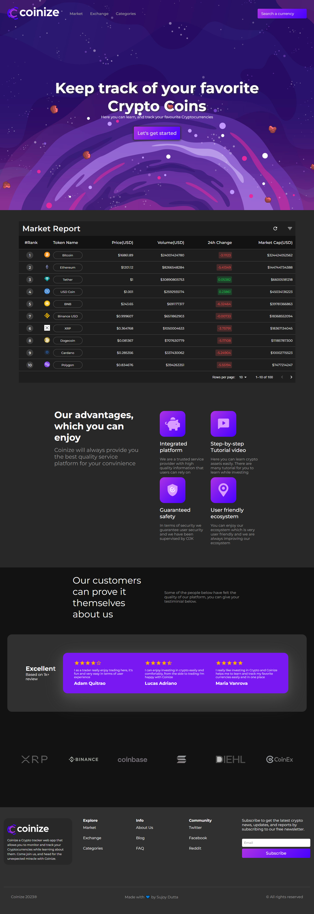

# Cryptocurrency Price Tracker React App

A Cryptocurrency Price Tracker shows the current prices, market cap, 24h change, and volume for all the cryptocurrencies in the world. The price is USD, and all the relevant details are shown in a custom-built Material-UI table.

# Version 2.0.0
Full app is still In developement. Features like navigation to different pages and dynamic routes are build into this tracker. 

(Live app here)[https://crypto-price-tracker.pages.dev]

# Why I build this
I build this app as cryptocurrency is booming in todays world and it's really important to monitor the real data before you start mining. The goal was to help data-miners to keep a track of the cryptocurrency prices, market cap, volumes and other parameters.

# What goes into building this app
This app is build with React, React-hooks like useState and useEffect and for content I used the coingecko API, fetched the data and used promises to get the request from the server. 

# Future Scope
Using D3.js to create a line graph or bar chart or both based on the data from the API

# Resources
The api used for tracking crypto can be found here - [https://www.coingecko.com/en/api/documentation](https://www.coingecko.com/en/api/documentation)

